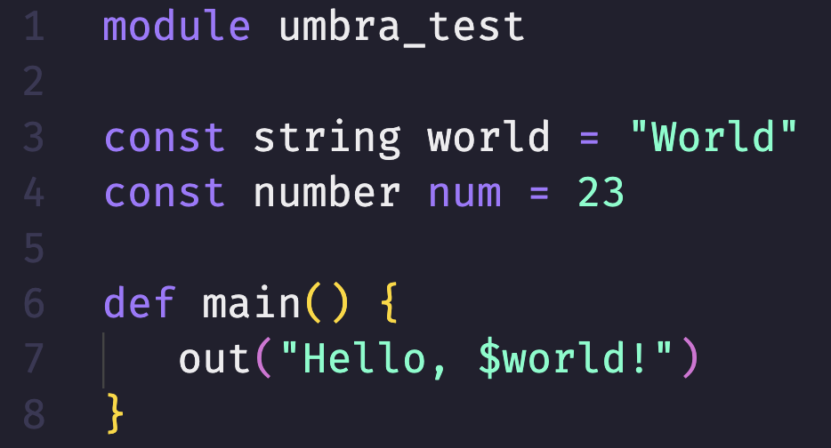

# Umbra language support for Visual Studio Code

```umb
# small umbra snippet code

package umbra_test

const string world -> "World"
const number num -> 23

def main() {
   out("Hello, $world!")
}
```

## Features

### Syntax Highlight



